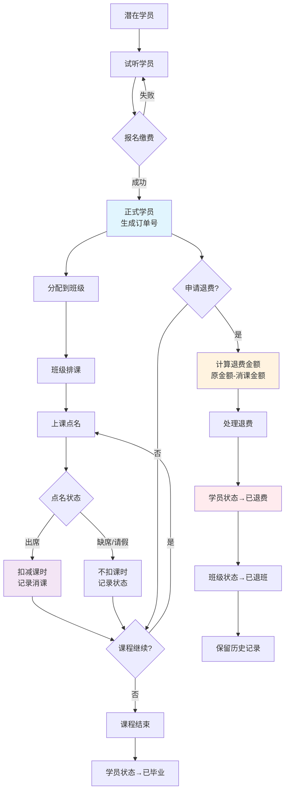
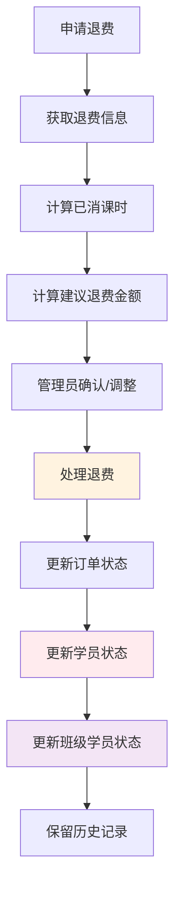

# 学员管理与点名业务流程文档

**版本**: 3.0
**日期**: 2025-08-22
**更新**: 完善退费业务流程，优化订单号管理，实现基于消课的退费计算

## 1. 业务流程概述

本系统采用**严格的报名驱动模式**，确保学员状态变化有明确的业务驱动，保证数据一致性和财务管理的准确性。

### 1.1 完整业务流程图



### 1.2 核心业务流程

```
潜在学员 → 试听学员 → [报名缴费] → 正式学员 → [分配班级] → [课程点名] → [课时扣减] → [退费处理]
```

### 1.3 关键业务规则

1. **学员状态管理**：只能通过报名流程获得正式学员状态
2. **班级分配**：只有正式学员且有对应课程报名记录才能加入班级
3. **点名扣费**：只对有报名记录的学员进行课时扣减
4. **退费处理**：基于实际消课情况计算退费金额
5. **订单管理**：每个报名记录自动生成唯一订单号
6. **数据保护**：已点名的排课记录不能删除，保证历史数据完整性

## 2. 数据库表结构与字段说明

### 2.1 学员表 (students)

| 字段名              | 类型         | 说明                                   | 约束             |
| ------------------- | ------------ | -------------------------------------- | ---------------- |
| id                  | bigint       | 主键                                   | AUTO_INCREMENT   |
| name                | varchar(255) | 学员姓名                               | NOT NULL         |
| phone               | varchar(20)  | 学员手机号                             | NULLABLE         |
| gender              | enum         | 性别：male/female                      | NULLABLE         |
| birth_date          | date         | 出生日期                               | NULLABLE         |
| parent_name         | varchar(255) | 家长姓名                               | NOT NULL         |
| parent_phone        | varchar(20)  | 家长手机号                             | NOT NULL         |
| parent_relationship | enum         | 家长关系：father/mother/guardian/other | NOT NULL         |
| **student_type**    | enum         | **学员类型**                           | NOT NULL         |
| follow_up_status    | enum         | 跟进状态                               | NOT NULL         |
| intention_level     | enum         | 意向等级                               | NOT NULL         |
| user_id             | bigint       | 关联用户 ID                            | NULLABLE         |
| institution_id      | bigint       | 所属机构 ID                            | NOT NULL         |
| source              | varchar(255) | 来源渠道                               | NULLABLE         |
| remarks             | text         | 备注信息                               | NULLABLE         |
| status              | enum         | 记录状态：active/inactive              | DEFAULT 'active' |

#### 学员类型 (student_type) 状态说明

| 状态值       | 中文名称     | 说明                     | 获得方式                   |
| ------------ | ------------ | ------------------------ | -------------------------- |
| potential    | 潜在学员     | 初步接触的潜在客户       | 手动创建                   |
| trial        | 试听学员     | 已安排试听课程的学员     | 手动创建                   |
| **enrolled** | **正式学员** | **已完成报名缴费的学员** | **仅通过报名流程自动获得** |
| graduated    | 已毕业       | 完成所有课程的学员       | 手动设置                   |
| suspended    | 暂停学习     | 暂时停止学习的学员       | 手动设置                   |

### 2.2 学员报名表 (student_enrollments)

| 字段名             | 类型          | 说明                             | 约束           |
| ------------------ | ------------- | -------------------------------- | -------------- |
| id                 | bigint        | 主键                             | AUTO_INCREMENT |
| student_id         | bigint        | 学员 ID                          | NOT NULL, FK   |
| institution_id     | bigint        | 机构 ID                          | NOT NULL, FK   |
| campus_id          | bigint        | 校区 ID                          | NOT NULL, FK   |
| course_id          | bigint        | 课程 ID                          | NOT NULL, FK   |
| enrollment_date    | date          | 报名日期                         | NOT NULL       |
| total_lessons      | decimal(8,2)  | 总课时数                         | NOT NULL       |
| used_lessons       | decimal(8,2)  | 已用课时数                       | DEFAULT 0      |
| remaining_lessons  | decimal(8,2)  | 剩余课时数                       | NOT NULL       |
| **status**         | enum          | **报名状态**                     | NOT NULL       |
| enrollment_fee     | decimal(10,2) | 报名费用（原价）                 | NOT NULL       |
| price_per_lesson   | decimal(8,2)  | 单课时价格                       | NOT NULL       |
| discount_type      | enum          | 折扣类型：none/percentage/amount | NOT NULL       |
| discount_value     | decimal(8,2)  | 折扣值                           | NOT NULL       |
| actual_amount      | decimal(10,2) | 实际收费金额                     | NOT NULL       |
| paid_amount        | decimal(10,2) | 已付金额                         | NOT NULL       |
| **payment_status** | enum          | **付款状态**                     | NOT NULL       |
| sales_person_id    | bigint        | 销售人员 ID                      | NOT NULL, FK   |

#### 报名状态 (status) 说明

| 状态值    | 中文名称 | 说明                     |
| --------- | -------- | ------------------------ |
| active    | 进行中   | 正常上课状态             |
| completed | 已完成   | 课时已用完               |
| suspended | 暂停     | 暂时停止上课             |
| cancelled | 已取消   | 报名已取消（通常因退费） |

#### 付款状态 (payment_status) 说明

| 状态值   | 中文名称 | 说明           |
| -------- | -------- | -------------- |
| unpaid   | 未付款   | 尚未付款       |
| partial  | 部分付款 | 已付部分费用   |
| paid     | 已付款   | 费用已全部付清 |
| refunded | 已退费   | 费用已退还     |

### 2.3 学员班级关联表 (student_classes)

| 字段名          | 类型   | 说明         | 约束           |
| --------------- | ------ | ------------ | -------------- |
| id              | bigint | 主键         | AUTO_INCREMENT |
| student_id      | bigint | 学员 ID      | NOT NULL, FK   |
| class_id        | bigint | 班级 ID      | NOT NULL, FK   |
| enrollment_date | date   | 入班日期     | NOT NULL       |
| **status**      | enum   | **班级状态** | NOT NULL       |

#### 班级状态 (status) 说明

| 状态值      | 中文名称 | 说明               |
| ----------- | -------- | ------------------ |
| active      | 在读     | 正常在班级中上课   |
| graduated   | 已毕业   | 从班级毕业         |
| dropped     | 已退班   | 主动或被动退出班级 |
| transferred | 已转班   | 转到其他班级       |

### 2.4 考勤记录表 (attendance_records)

| 字段名                | 类型         | 说明               | 约束                      |
| --------------------- | ------------ | ------------------ | ------------------------- |
| id                    | bigint       | 主键               | AUTO_INCREMENT            |
| schedule_id           | bigint       | 课程安排 ID        | NOT NULL, FK              |
| student_id            | bigint       | 学员 ID            | NOT NULL, FK              |
| **attendance_status** | enum         | **出勤状态**       | NOT NULL                  |
| **deducted_lessons**  | decimal(8,2) | **实际扣除课时数** | DEFAULT 1.00              |
| check_in_time         | timestamp    | 签到时间           | NULLABLE                  |
| absence_reason        | varchar(200) | 缺席原因           | NULLABLE                  |
| makeup_required       | boolean      | 是否需要补课       | DEFAULT false             |
| makeup_scheduled      | boolean      | 是否已安排补课     | DEFAULT false             |
| teacher_notes         | text         | 教师备注           | NULLABLE                  |
| recorded_by           | bigint       | 记录人 ID          | NOT NULL, FK              |
| recorded_at           | timestamp    | 记录时间           | DEFAULT CURRENT_TIMESTAMP |

#### 出勤状态 (attendance_status) 说明

| 状态值         | 中文名称 | 默认扣课时 | 说明               |
| -------------- | -------- | ---------- | ------------------ |
| present        | 到课     | 1.0        | 正常出勤           |
| late           | 迟到     | 0          | 迟到到课（可调整） |
| absent         | 缺勤     | 0          | 无故缺席           |
| personal_leave | 请假     | 0          | 事假               |
| sick_leave     | 病假     | 0          | 病假               |
| leave_early    | 早退     | 0.5        | 早退（可调整）     |

## 3. 业务流程详细说明

### 3.1 学员创建流程

**前置条件**：无  
**操作权限**：管理员、销售人员

**流程步骤**：

1. 填写学员基本信息
2. 选择学员类型（仅限：潜在学员、试听学员）
3. 设置跟进状态和意向等级
4. 可选择创建家长账号
5. 系统创建学员记录

**状态变更**：

-   新建学员 → `student_type` = `potential` 或 `trial`

**API 接口**：`POST /api/admin/students`

**业务规则**：

-   ❌ 不能直接创建正式学员
-   ✅ 只能选择潜在学员或试听学员
-   ✅ 正式学员状态必须通过报名流程获得

### 3.2 学员报名流程

**前置条件**：学员已存在（潜在学员或试听学员）  
**操作权限**：管理员、销售人员

**流程步骤**：

1. 选择学员和课程
2. 设置课时数量和价格
3. 计算折扣和实际金额
4. 确认报名信息
5. 系统创建报名记录
6. **自动将学员状态改为正式学员**

**状态变更**：

-   报名记录：`status` = `active`, `payment_status` = `paid`
-   学员状态：`student_type` = `enrolled`

**API 接口**：`POST /api/admin/enrollments`

**业务规则**：

-   ✅ 报名成功后自动升级为正式学员
-   ✅ 一个学员可以报名多个课程
-   ✅ 每个课程报名都有独立的课时计算

### 3.3 班级分配流程

**前置条件**：学员为正式学员且有对应课程的有效报名记录
**操作权限**：管理员、教务人员

**流程步骤**：

1. 选择班级
2. 搜索符合条件的学员（正式学员 + 有对应课程报名）
3. 选择要添加的学员
4. 系统验证学员资格
5. 创建学员班级关联记录

**状态变更**：

-   学员班级关联：`status` = `active`

**API 接口**：`POST /api/admin/student-classes`

**业务规则**：

-   ❌ 只有正式学员才能加入班级
-   ❌ 必须有对应课程的有效报名记录
-   ✅ 一个学员可以同时在多个班级
-   ✅ 系统自动验证学员资格

### 3.4 课程点名流程

**前置条件**：班级有课程安排，学员已分配到班级
**操作权限**：管理员、教师

**流程步骤**：

1. 选择课程安排
2. 系统显示有报名记录的班级学员
3. 为每个学员设置出勤状态
4. 调整扣除课时数（支持 0.5 课时增减）
5. 填写教师备注
6. 确认提交点名记录
7. **系统自动扣减对应报名记录的剩余课时**

**状态变更**：

-   考勤记录：创建新记录
-   报名记录：`remaining_lessons` 减少，`used_lessons` 增加

**API 接口**：

-   获取点名信息：`GET /api/admin/class-schedules/{schedule}/attendance`
-   保存点名记录：`POST /api/admin/class-schedules/{schedule}/attendance`

**业务规则**：

-   ✅ 只显示有有效报名记录的学员
-   ✅ 支持灵活的课时扣减（0-10 课时，支持 0.5 增量）
-   ✅ 自动计算并更新剩余课时
-   ✅ 支持修改已有点名记录

### 3.5 退费处理流程

**前置条件**：学员有有效的报名记录
**操作权限**：管理员、财务人员

**流程步骤**：

1. 选择要退费的报名记录
2. 计算退费金额
3. 确认退费操作
4. 系统更新报名记录状态
5. **检查学员是否还有其他有效报名**
6. **如无其他报名，自动调整学员状态为试听学员**

**状态变更**：

-   报名记录：`payment_status` = `refunded`, `status` = `cancelled`
-   学员状态：如无其他有效报名，`student_type` = `trial`

**API 接口**：`POST /api/admin/enrollments/{enrollment}/refund`

**业务规则**：

-   ✅ 退费后自动调整学员状态
-   ✅ 保留学员的基本信息和历史记录
-   ✅ 退费学员不能继续参与点名

## 4. API 接口汇总

### 4.1 学员管理接口

| 方法   | 路径                                  | 说明                 | 权限         |
| ------ | ------------------------------------- | -------------------- | ------------ |
| GET    | `/api/admin/students`                 | 获取学员列表         | 管理员、销售 |
| POST   | `/api/admin/students`                 | 创建学员             | 管理员、销售 |
| GET    | `/api/admin/students/{id}`            | 获取学员详情         | 管理员、销售 |
| PUT    | `/api/admin/students/{id}`            | 更新学员信息         | 管理员、销售 |
| DELETE | `/api/admin/students/{id}`            | 删除学员             | 管理员       |
| GET    | `/api/admin/students/creatable-types` | 获取可创建的学员类型 | 管理员、销售 |

### 4.2 报名管理接口

| 方法 | 路径                                 | 说明         | 权限         |
| ---- | ------------------------------------ | ------------ | ------------ |
| GET  | `/api/admin/enrollments`             | 获取报名列表 | 管理员、销售 |
| POST | `/api/admin/enrollments`             | 创建报名记录 | 管理员、销售 |
| GET  | `/api/admin/enrollments/{id}`        | 获取报名详情 | 管理员、销售 |
| PUT  | `/api/admin/enrollments/{id}`        | 更新报名信息 | 管理员、销售 |
| POST | `/api/admin/enrollments/{id}/refund` | 处理退费     | 管理员、财务 |

### 4.3 班级管理接口

| 方法   | 路径                              | 说明             | 权限         |
| ------ | --------------------------------- | ---------------- | ------------ |
| GET    | `/api/admin/student-classes`      | 获取班级学员列表 | 管理员、教务 |
| POST   | `/api/admin/student-classes`      | 添加学员到班级   | 管理员、教务 |
| DELETE | `/api/admin/student-classes/{id}` | 移除班级学员     | 管理员、教务 |

### 4.4 点名管理接口

| 方法 | 路径                                               | 说明             | 权限         |
| ---- | -------------------------------------------------- | ---------------- | ------------ |
| GET  | `/api/admin/class-schedules/{schedule}/attendance` | 获取点名信息     | 管理员、教师 |
| POST | `/api/admin/class-schedules/{schedule}/attendance` | 保存点名记录     | 管理员、教师 |
| GET  | `/api/admin/classes/{classId}/attendance-records`  | 获取班级点名记录 | 管理员、教师 |

### 4.5 退费管理接口

| 方法 | 路径                                      | 说明             | 权限   |
| ---- | ----------------------------------------- | ---------------- | ------ |
| GET  | `/api/admin/enrollments/{id}/refund-info` | 获取退费计算信息 | 管理员 |
| POST | `/api/admin/enrollments/{id}/refund`      | 处理退费申请     | 管理员 |

#### 退费计算逻辑

```php
// 计算已消课数量（基于点名记录）
$attendedLessons = AttendanceRecord::whereHas('schedule', function ($query) use ($enrollment) {
    $query->whereHas('class.students', function ($q) use ($enrollment) {
        $q->where('student_classes.student_id', $enrollment->student_id)
          ->where('student_classes.status', 'active');
    });
})
->where('student_id', $enrollment->student_id)
->where('attendance_status', 'present') // 只统计出席的课程
->count();

// 计算退费金额
$consumedAmount = $attendedLessons * $enrollment->price_per_lesson;
$suggestedRefundAmount = max(0, $enrollment->actual_amount - $consumedAmount);
```

## 5. 前端页面与功能

### 5.1 学员管理页面

-   **路径**：`/academic/students`
-   **功能**：学员列表、创建学员、编辑学员、查看详情
-   **限制**：创建时只能选择潜在学员或试听学员

### 5.2 订单管理页面

-   **路径**：`/finance/orders`
-   **功能**：订单列表、订单详情、申请退费
-   **特色**：
    -   显示业务订单号（格式：ORD20250822001）
    -   智能退费计算（自动扣除消课金额）
    -   退费明细展示
    -   管理员可手动调整退费金额

### 5.3 学员详情页面

-   **路径**：`/academic/students/{id}`
-   **功能**：学员信息、订单记录查看（只读）
-   **限制**：不提供退费操作，引导用户到订单管理页面

### 5.4 班级管理页面

-   **路径**：`/academic/classes/{id}`
-   **功能**：班级详情、学员管理、课程安排、点名记录
-   **限制**：只能添加有对应课程报名的正式学员
-   **特色**：
    -   已退费学员自动从班级学员列表中移除
    -   保留历史点名记录
    -   排课状态智能显示（未点名/已点名）

### 5.5 点名功能

-   **位置**：班级详情页 → 排课信息 → 点名按钮
-   **功能**：出勤状态选择、课时扣减、教师备注
-   **特色**：
    -   按钮组选择状态、数字输入框调整课时
    -   未来日期课程不允许点名
    -   已点名课程显示"修改点名"按钮
    -   已点名的排课不能删除

## 6. 退费业务流程详解

### 6.1 退费触发条件

1. **学员主动申请**：学员因个人原因申请退费
2. **课程质量问题**：因教学质量问题申请退费
3. **特殊情况**：疫情、搬迁等不可抗力因素

### 6.2 退费计算规则

#### 基础计算公式

```
退费金额 = 订单原金额 - (已消课时数 × 课时单价)
```

#### 消课统计规则

-   **统计范围**：只统计 `attendance_status = 'present'` 的点名记录
-   **统计条件**：学员必须在对应班级且状态为 `active`
-   **时间范围**：从报名日期到申请退费日期

#### 退费金额限制

-   **最低退费**：0 元（不能为负数）
-   **最高退费**：订单原金额
-   **管理员调整**：允许管理员根据实际情况手动调整

### 6.3 退费处理流程



### 6.4 退费后状态变化

| 数据表              | 字段           | 变化前   | 变化后    | 说明     |
| ------------------- | -------------- | -------- | --------- | -------- |
| student_enrollments | payment_status | paid     | refunded  | 订单状态 |
| student_enrollments | status         | active   | cancelled | 报名状态 |
| students            | student_type   | enrolled | refunded  | 学员类型 |
| student_classes     | status         | active   | dropped   | 班级状态 |
| attendance_records  | -              | 保持不变 | 保持不变  | 历史记录 |

### 6.5 退费业务规则

1. **数据保护**：已点名的排课记录不能删除
2. **历史保留**：所有点名记录完整保留
3. **状态联动**：退费后自动更新相关状态
4. **权限控制**：只有管理员可以处理退费
5. **金额验证**：退费金额不能超过订单原金额

### 6.6 订单号管理

#### 订单号生成规则

```php
// 格式：ORD + 日期 + 微秒时间戳后6位
$date = date('Ymd');
$microtime = str_replace('.', '', microtime(true));
$suffix = substr($microtime, -6);
$orderNumber = 'ORD' . $date . $suffix;

// 示例：ORD20250822123456
```

#### 订单号特点

-   **唯一性**：基于微秒时间戳确保唯一
-   **可读性**：包含日期信息，便于识别
-   **业务性**：区别于数据库自增 ID
-   **自动化**：创建报名记录时自动生成

## 7. 数据一致性保证

### 7.1 状态同步机制

1. **报名成功** → 自动升级学员状态
2. **退费处理** → 自动降级学员状态
3. **点名扣费** → 自动更新剩余课时
4. **班级分配** → 验证学员资格

### 6.2 业务约束

1. **学员状态约束**：正式学员状态只能通过报名获得
2. **班级分配约束**：只有正式学员且有报名记录才能加入班级
3. **点名约束**：只对有报名记录的学员进行课时扣减
4. **退费约束**：退费后自动调整相关状态

### 6.3 数据完整性

1. **外键约束**：确保关联数据的完整性
2. **状态验证**：前后端双重验证业务规则
3. **事务处理**：关键操作使用数据库事务
4. **软删除**：重要数据使用软删除保留历史

## 7. 维护说明

### 7.1 常见问题排查

1. **学员无法加入班级**：检查学员状态和报名记录
2. **点名时学员不显示**：检查报名记录是否有效
3. **课时扣减异常**：检查考勤记录和报名记录的关联

### 7.2 数据修复

1. **状态不一致**：使用后台命令修复学员状态
2. **课时计算错误**：重新计算报名记录的课时数据
3. **关联数据缺失**：检查并修复外键关联

### 7.3 系统扩展

1. **新增学员状态**：修改 Student 模型的常量定义
2. **新增出勤状态**：修改 AttendanceRecord 模型的常量
3. **新增业务规则**：在相应的控制器中添加验证逻辑

---

**文档维护**：请在修改相关业务逻辑时及时更新本文档
**最后更新**：2025-08-22
**负责人**：系统开发团队
