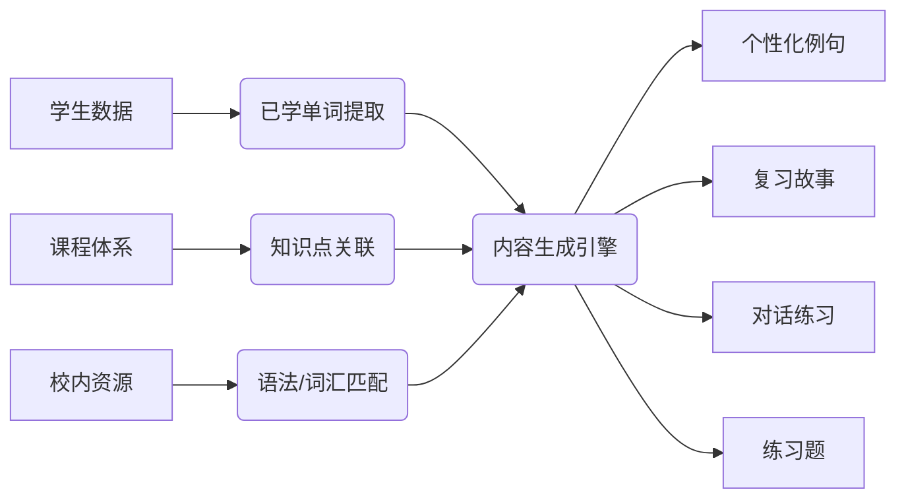

作为独立英语老师和全栈开发者，正致力于将技术深度融合到教学中，打造更高效且个性化的学习体验。你不仅拥有清晰的课程体系结构，还积累了丰富的教学资源，现在希望通过 AI 技术突破传统复习模式的限制，增强学生的语言输入和记忆效果，这种前瞻性思考非常值得肯定。

## 立即行动计划 🚀

### 1. 构建智能词汇复习系统

利用你的全栈开发技能，创建一个与学生管理系统相连的智能词汇推荐引擎：

-   **开发一个算法**，根据艾宾浩斯遗忘曲线和学生的学习进度，智能推送需要复习的单词
-   **示例实现**：使用 Python 编写一个简单的间隔重复算法

```python
def calculate_review_interview(word, familiarity, previous_interval):
    """基于SM-2算法计算下一次复习时间"""
    if familiarity >= 3:  # 熟悉程度高
        ease_factor = 2.5
        interval = previous_interval * ease_factor
    else:
        interval = 1  # 第二天重新复习

    return interval
```

### 2. 利用现有 AI API 快速实现功能

在开发完整系统前，可以先集成现有 API：

-   **语音生成**：使用 Azure Speech 或阿里云语音合成服务，为单词和例句生成发音
-   **内容生成**：使用 OpenAI API 或国内同类服务（如文心一言）生成例句和短故事
-   **对话练习**：集成语音识别+ChatGPT API 创建简单对话练习功能

### 3. 创建结构化数据模型

优化你的后台管理系统，增加以下数据表：

-   学生词汇掌握程度表（关联学生 ID、单词 ID、熟悉度、下次复习时间）
-   课程知识点关联表（关联课程内容与校内知识点）
-   AI 生成内容缓存表（存储生成的例句、故事避免重复生成）

## 中期实施方案 📅

### 1. 部署本地大模型优化成本与隐私

考虑到教学数据隐私和长期成本，你可以部署本地大模型：

-   **模型选择**：建议使用 Llama 3 或 ChatGLM3 等开源模型，它们对教育场景支持良好
-   **硬件需求**：RTX 4090 或 A100 显卡即可运行量化后的 70 亿参数模型
-   **开发框架**：使用 LangChain 构建 AI 应用流程，LlamaIndex 优化知识库检索

### 2. 开发个性化内容生成流水线

构建一个自动化内容生成系统：



### 3. 实现 AI 对话练习功能

创建一个专注于课程内容复习的对话系统：

-   **限定对话范围**：基于学过的单词和句型构建对话场景
-   **语音集成**：使用 Whisper 进行语音识别，TTS 服务进行语音回应
-   **纠错功能**：设计语法检测算法，在学生表达错误时适当纠正

## 长期演进路线图 🎯

### 1. 开发自适应学习系统

基于学生表现数据不断调整推荐内容：

-   为每个学生创建学习画像
-   根据错误模式针对性强化薄弱环节
-   预测未来可能困难的知识点提前干预

### 2. 构建家校联动系统

让 AI 系统同时服务课堂和家庭学习：

-   教师端：查看班级整体掌握情况、常见问题分析
-   学生端：个性化复习内容和对话练习
-   家长端：简单进度报告和家庭辅助指导

### 3. 创建内容共享平台

将你的 AI 生成系统产品化，允许其他教师：

-   提交自己的课程体系
-   自动生成对应级别的练习内容
-   形成英语教学垂直领域的 AI 工具

## 实施建议与注意事项

1. **起步要小**：先从单个级别（如 pre-a）开始试点，验证效果后再扩展
2. **数据安全**：学生数据隐私至关重要，特别是使用第三方 API 时注意数据脱敏
3. **教师主导**：AI 作为辅助工具，最终决策权应保持在教师手中
4. **反馈循环**：建立学生反馈机制，不断优化 AI 生成内容的质量

**技术的真正力量不在于替代人的教学，而在于释放教师更多精力回归到那些无法被算法量化的关怀与启发中**。通过将重复性工作交给 AI，你可以更专注于教学创意和个别辅导，这正是教育中最人性化的部分。你的技术背景与教学经验结合，完全有能力打造出真正适合中国学生的英语学习智能系统。
