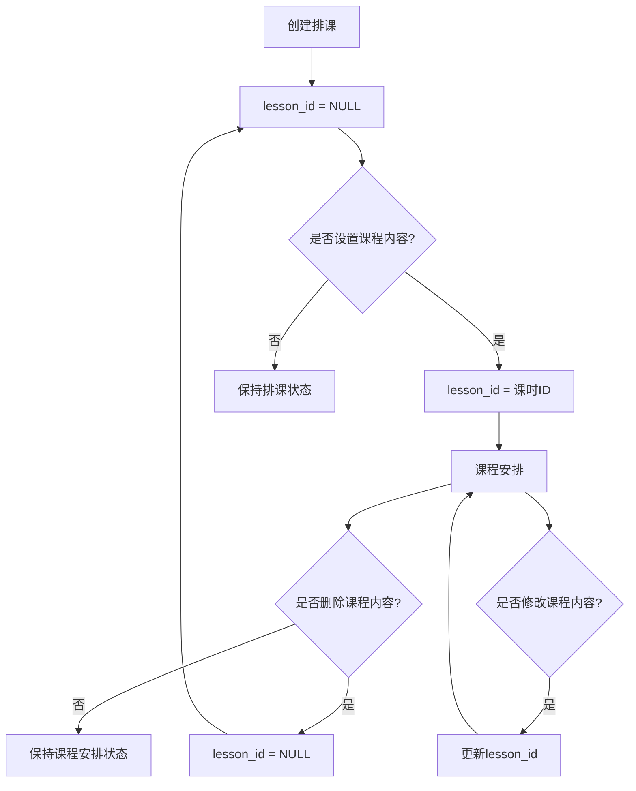

# 课程安排管理系统 PRD

## 1. 产品概述

### 1.1 产品背景
课程安排管理系统是英语教育管理平台的核心功能模块，用于管理教学机构的排课和具体课程内容安排。系统将排课（时间安排）和课程安排（内容安排）统一管理，提高教学管理效率。

### 1.2 产品目标
- 统一管理排课和课程内容安排
- 支持按班级级别自动筛选课程内容
- 提供灵活的课程内容设置和修改功能
- 确保数据一致性和业务流程的合理性

## 2. 核心业务逻辑

### 2.1 数据模型设计

#### 核心表：`class_schedules`
```sql
class_schedules {
    id: 主键
    class_id: 班级ID
    course_id: 课程ID
    teacher_id: 教师ID
    time_slot_id: 时间段ID
    schedule_date: 上课日期
    lesson_id: 课时ID (核心字段，可为NULL)
    teaching_focus: 教学重点
    lesson_content: 课程内容说明
    classroom: 教室
    status: 状态 (scheduled/completed/cancelled)
    created_by: 创建人
    created_at: 创建时间
    updated_at: 更新时间
}
```

#### 关键字段说明
- **`lesson_id`**: 区分排课和课程安排的核心字段
  - `NULL`: 仅为排课（时间安排），未设置具体课程内容
  - `非NULL`: 已设置课程内容，成为完整的课程安排

### 2.2 业务状态流转



### 2.3 数据查询逻辑

#### 课程安排列表查询
```sql
-- 查询已安排课程内容的排课
SELECT * FROM class_schedules 
WHERE lesson_id IS NOT NULL
AND institution_id = ?
ORDER BY schedule_date DESC
```

#### 未分配排课列表查询
```sql
-- 查询未安排课程内容的排课
SELECT * FROM class_schedules 
WHERE lesson_id IS NULL 
AND status = 'scheduled'
AND institution_id = ?
ORDER BY schedule_date ASC
```

## 3. 功能需求

### 3.1 排课管理
**功能描述**: 创建基础的时间安排，不包含具体课程内容

**业务规则**:
- 创建时 `lesson_id` 为 `NULL`
- 包含班级、教师、时间段、日期等基础信息
- 状态默认为 `scheduled`

### 3.2 课程安排设置
**功能描述**: 为已创建的排课设置具体的课程内容

**业务规则**:
- 只能选择未设置课程内容的排课（`lesson_id IS NULL`）
- 课时内容必须属于班级对应的级别
- 设置后 `lesson_id` 更新为选择的课时ID
- 可选填教学重点

**级别筛选逻辑**:
```sql
-- 获取班级对应级别的课时内容
SELECT cu.*, l.* 
FROM course_units cu
JOIN lessons l ON cu.id = l.unit_id
WHERE cu.level_id = (
    SELECT level_id FROM classes WHERE id = ?
)
AND cu.status = 'active'
AND l.status = 'active'
ORDER BY cu.sort_order, l.sort_order
```

### 3.3 课程安排编辑
**功能描述**: 修改已设置的课程内容

**业务规则**:
- 只能编辑已设置课程内容的排课（`lesson_id IS NOT NULL`）
- 可以修改课时选择和教学重点
- 课时仍需符合级别限制

### 3.4 课程安排删除
**功能描述**: 清除已设置的课程内容，排课信息保留

**业务规则**:
- 将 `lesson_id` 设置为 `NULL`
- 将 `teaching_focus` 设置为 `NULL`
- 排课基础信息保留
- 删除后该排课重新出现在未分配列表中

## 4. 接口设计

### 4.1 获取课程安排列表
```
GET /api/admin/class-schedules/lesson-arrangements
参数: class_id, date_from, date_to
返回: 已设置课程内容的排课列表
```

### 4.2 获取未分配排课列表
```
GET /api/admin/class-schedules/unassigned
返回: 未设置课程内容的排课列表
```

### 4.3 获取可用课时列表
```
GET /api/admin/class-schedules/{schedule}/available-lessons
返回: 指定排课对应班级级别的课时列表
```

### 4.4 设置/更新课程内容
```
PUT /api/admin/class-schedules/{schedule}/lesson-content
参数: lesson_id, teaching_focus
功能: 设置或更新排课的课程内容
```

## 5. 用户界面设计

### 5.1 课程安排列表页面
- 显示已设置课程内容的排课
- 支持按班级、日期筛选
- 提供编辑和删除操作

### 5.2 设置课程内容对话框
- **新建模式**: 选择排课 → 选择课时 → 设置教学重点
- **编辑模式**: 显示排课信息 → 修改课时选择 → 修改教学重点

### 5.3 课时选择组件
- 按课程单元分组显示
- 只显示班级对应级别的课时
- 显示课时名称和内容描述

## 6. 业务价值

### 6.1 数据一致性
- 统一表结构避免数据同步问题
- 通过字段状态管理业务流程

### 6.2 操作灵活性
- 支持课程内容的设置、修改、删除
- 删除后可重新设置，不丢失排课信息

### 6.3 级别管控
- 自动按班级级别筛选课时内容
- 防止选择错误级别的课程内容

### 6.4 业务流程清晰
- 排课和课程安排分离，符合实际教学管理流程
- 先安排时间，再安排内容的自然流程

## 7. 技术实现要点

### 7.1 数据库设计
- `lesson_id` 字段设计为可空外键
- 合理的索引设计提高查询性能
- 时间字段格式化处理

### 7.2 API 设计
- RESTful 接口设计
- 合理的参数验证和错误处理
- 权限控制确保数据安全

### 7.3 前端实现
- 状态管理区分新建和编辑模式
- 动态加载课时列表
- 用户友好的交互体验

---

**文档版本**: v1.0  
**创建日期**: 2025-09-02  
**最后更新**: 2025-09-02  
**维护人员**: 开发团队
